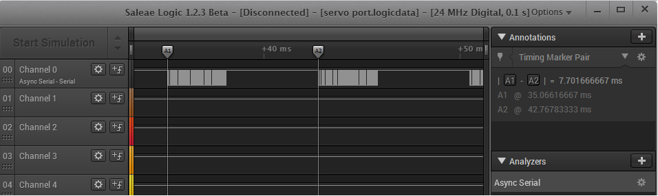

# FLYSKY I6 IBUS: 14 CHANNELS

https://basejunction.wordpress.com/2015/08/23/en-flysky-i6-14-channels-part1/

**IBus Transmission**

The FS-i6 has an IBus interface. It means that it can communicate the servo commands to the flight controller by some kind of serial communication. It has the advantage of limiting the number of wires between Rx and FC, but also implements a digital transmission means.


To see what is happening on the serial interface between the Rx and the FC we can use a logic analyzer and sniff the output servo port. We are using a Saleae logic analyzer here.



We see that a frame is sent approximately every 7.7ms. We expect to find our 6 channels in this frame. During sniffing, the command was in the default state, so we should find 1500 for the pitch, the yaw and the roll, 1000 for the thrust and 2000 for the 2 auxiliary channels. In hexadecimal, 1500 equals 0x05DC. Here we have a zoom on one of the frame, decoded by the software. (Serial 115200 bauds, 8n1)


As we can see, the 3rd and 4th byte equals 0x05DC (they are sent low byte first) and the 5th and 6th equals 0X05DB.

We take the whole frame and group the bytes by 2:
``` C
> x20x40  = Header
> xDCx05  = 1500 ch 1
> xDBx05  = 1499 ch 2
> xEFx03  = 1007 ch 3
> xDDx05  = 1501 ch 4
> xD0x07  = 2000 ch 5
> xD0x07  = 2000 ch 6
> xDCx05  = 1500
> xDCx05  = 1500
> xDCx05  = 1500
> xDCx05  = 1500
> xDCx05  = 1500
> xDCx05  = 1500
> xDCx05  = 1500
> xDCx05  = 1500
> x54xF3  = Checksum: 0xF354 -> calculated by adding up all previous bytes, total must be FFFF
```
$20$40$DC$05$DB$05$EF$03$DD$05$D0$07$D0$07$DC$05$DC$05$DC$05$DC$05$DC$05$DC$05$DC$05$DC$05$54$F3

We see a header of 2 bytes, then 12 bytes for our 6 channels and at the end 2 bytes of footer, with a checksum at the end. Between the end and the 6 channels we see 8 more channels, fixed at 1500. This brings the total numer of channels to 14.


